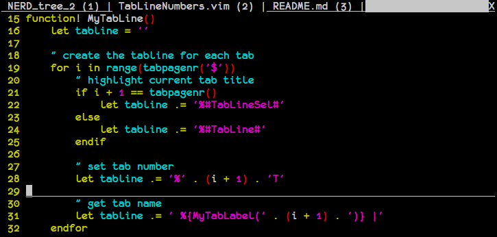

# Tab titles with numbers

A [Vim](http://www.vim.org/) plugin which shows numbers for each tab. It helps you to navigate to the tab using ```<tab number>gt```.

See how it looks on the screenshot bellow:

